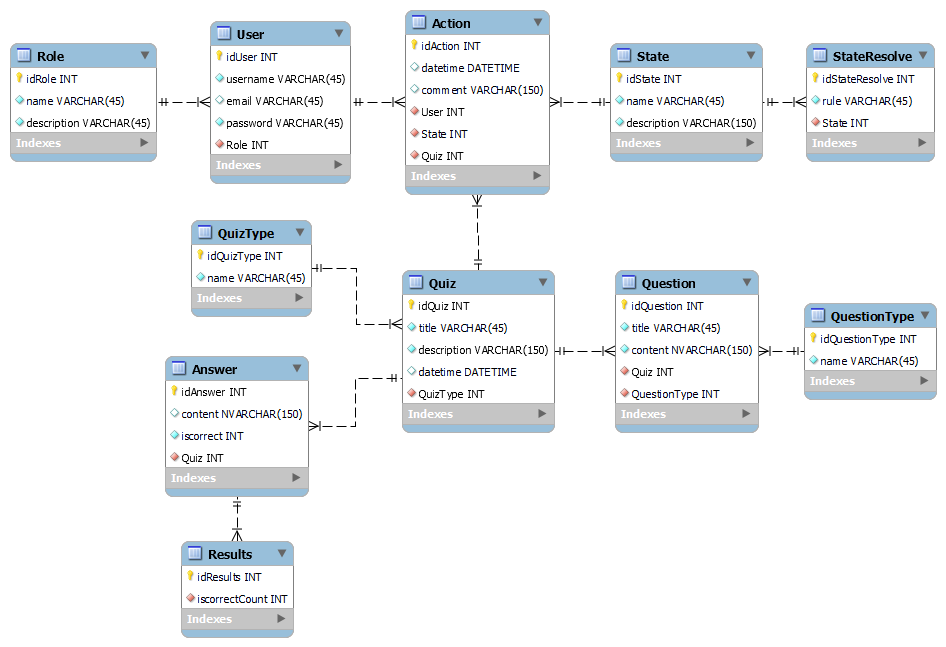

# Проєктування бази даних

В рамках проекту розробляється: 

<h2>Модель бізнес-об'єктів</h2>  

@startuml

  
 entity Quiz
  
entity Question
entity Question.id
entity Question.content
entity Question.type

entity User
entity User.id
entity User.username
entity User.email
entity User.password

entity Action
entity Action.id
entity Action.datetime
entity Action.comment

entity Quiz
entity Quiz.id
entity Quiz.type
entity Quiz.title
entity Quiz.description
entity Quiz.datetime

entity Role
entity Role.id
entity Role.name
entity Role.description

entity Administrator
entity Manager
entity RegularUser

Administrator -d-|> Role
Manager -d-|> Role
RegularUser -d-|> Role

User.id --* User
User.username --* User
User.email --* User
User.password --* User

entity Answer
entity Answer.id
entity Answer.description 
entity Answer.datetime

entity Answer
entity Answer.id
entity Answer.description 
entity Answer.datetime

Role *--- Role.id
Role *--- Role.name
Role *--- Role.description

Quiz *--- Quiz.id
Quiz *--- Quiz.title
Quiz *--- Quiz.type
Quiz *--- Quiz.description
Quiz *--- Quiz.datetime

Action *--- Action.id
Action *--- Action.title
Action *--- Action.datetime
Action *--- Action.comment

Question *--- Question.id
Question *--- Question.content
Question *--- Question.type

Answer *--- Answer.id
Answer *--- Answer.description
Answer *--- Answer.datetime

Quiz "1,1" --- "0,*" Question
Question "1,1" -l- "0,*" Answer
Action "1,1" --- "1,*" User
Role "1,1" -d- "0,*" User
User "1,1" --- "1,*" Quiz

@enduml

<h2>ER-модель</h2> 

@startuml

  
entity Quiz {
    id: UUID
    title: TEXT
    description: TEXT
    datetime: DATETIME
}

entity QuizType <<ENUMERATION>> {
    id: UUID
    name: TEXT
}

entity User {
    id: UUID
    username: TEXT
    email: TEXT
    password: TEXT
}
  
entity Question {
    id: UUID
    title: TEXT
    content: TEXT
}

entity QuestionType <<ENUMERATION>> {
    id: UUID
    name: TEXT
}

entity Answer {
    id: UUID
    content: TEXT
    datetime: DATETIME
}

entity Action {
    id: UUID
    datetime: DATETIME <<NULLABLE>>
    comment: TEXT
}

entity State <<ENUMERATION>> {
    id: UUID
    name: TEXT
    description: TEXT
}

entity StateResolve <<ENUMERATION>> {
    id: UUID
    rule: TEXT
}

entity Role <<ENUMERATION>> {
    id: UUID
    name: TEXT
    description: TEXT
}

User "0,*" ->  "1,1" Role

Quiz *--- Quiz.id
Quiz *--- Quiz.description
Quiz *--- Quiz.type
Quiz *--- Quiz.title
Quiz *--- Quiz.datetime
Quiz *--- Quiz.state

Question *--- Question.id
Question *--- Question.content
Question *--- Question.type

Answer *--- Answer.id
Answer *--- Answer.description
Answer *--- Answer.datetime

Quiz "1,1"--l-- "0,*" Question
Question "1,1" --l-- "0,*" Answer

QuizType "1,1" <-- "0,*" Quiz
QuestionType "1,1" <-- "0,*" Question
Action "0,*" --> "1,1" User
Action "0*" --> "1,1" Quiz
Action "0*" --> "1,1" State
StateResolve "0*" --> "1,1" State :previous
StateResolve "0*" --> "1,1" State :next

@enduml

<h2>Реляційна схема</h2> 

