# Тестування працездатності системи

## Відобразити список усіх акаунтів (GET)
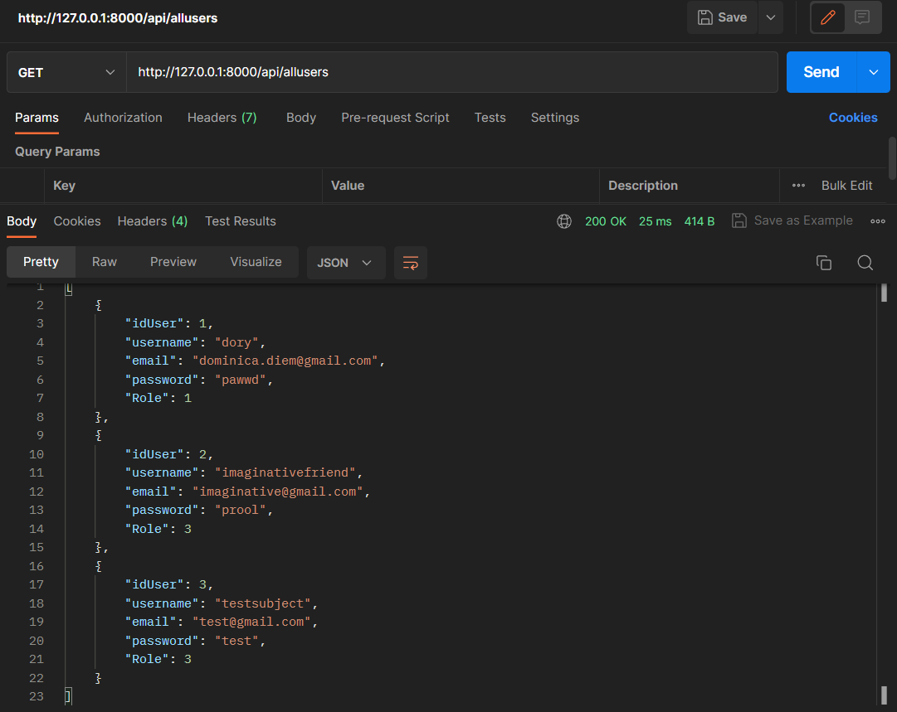

## Додати новий акаунт (POST)
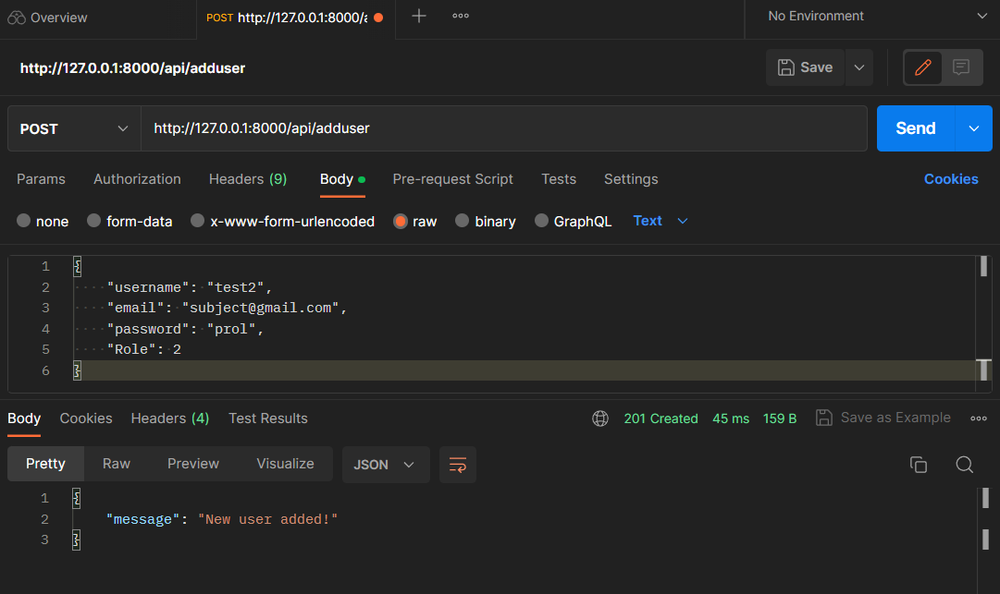

## Перевіряємо наявність нового акаунту (GET)
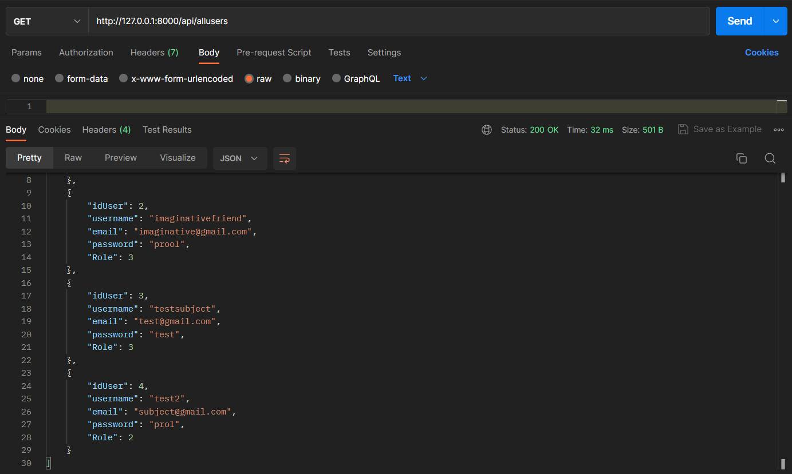

## Шукаємо юзера по id (GET)
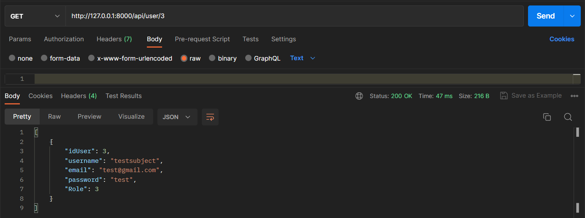

## Шукаємо неіснуючого юзера (GET)
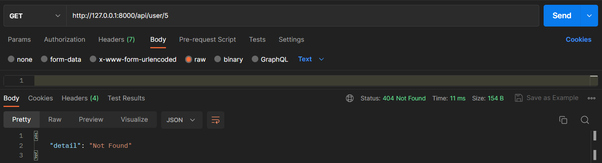

## Оновлюємо дані акаунту (PUT)
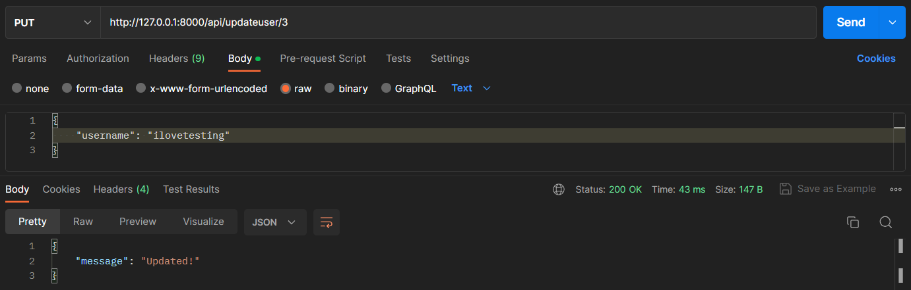

## Перевіряємо наявність змін (GET)
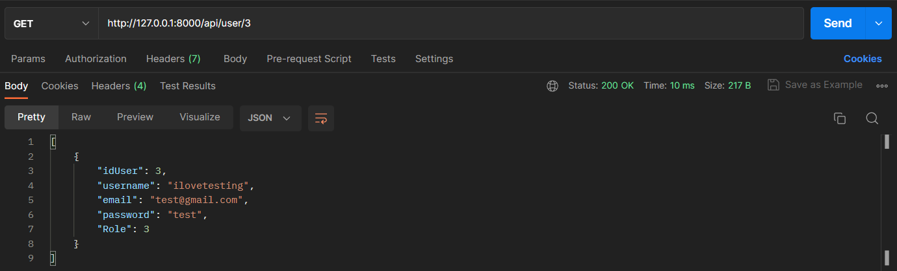

## Пробуємо змінити дані неіснуючого акаунту (PUT)
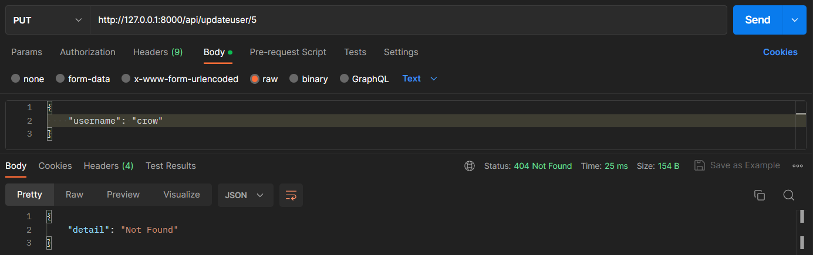

## Видаляємо акаунт (DELETE)
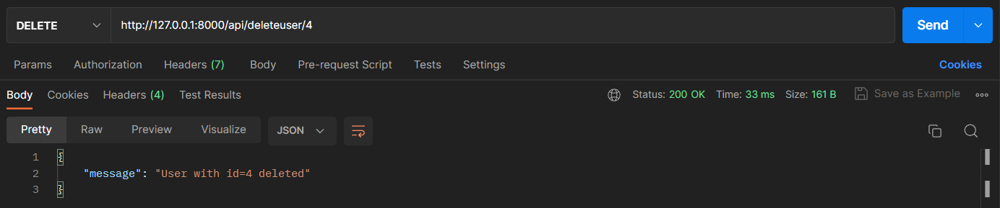

## Перевіряємо, що акаунту більше нема (GET)
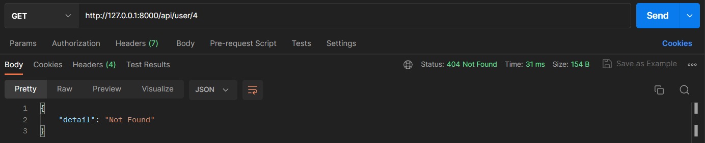

## Намагаємось видалити неіснуючий акаунт (DELETE)
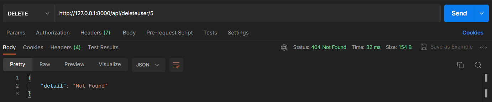